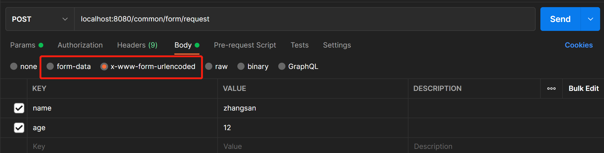

# MVC 接口传参总结

# 1. URL 地址传参

请求形式：`http://localhost:8080/get/url/10086`

请求方法：`GET` `POST`

获取参数：

```java
@RequestMapping(value = "url/{id}", method = {RequestMethod.GET, RequestMethod.POST})
public String testPathParam(@PathVariable("id") String id) {
    return "URL 传参 " + id;
}
```

# 2. URL 拼接参数

请求形式：`http://localhost:8080/common/url?name=zhangsan&age=12` 

请求方法：`GET` `POST` 

对应 Postman：


## 1. 从 HTTPRequest 请求体中获取参数

```java
@RequestMapping(value = "url", method = {RequestMethod.GET, RequestMethod.POST})
public String testEmpty(HttpServletRequest request) {
    Map<String, String[]> paramMap = request.getParameterMap();
    return "URL 传参: name=" + request.getParameter("name") + ", age=" + request.getParameter("age");
}
```

## 2. @RequestParam，该方式参数不能为空

```java
@RequestMapping(value = "param", method = {RequestMethod.GET, RequestMethod.POST})
public String testParam(@RequestParam("name") String name, @RequestParam Integer age) {
    return "URL 传参: name=" + name + ", age=" + age;
}
```

## 3. 直接映射，参数可以为空

```java
@RequestMapping(value = "default", method = {RequestMethod.GET, RequestMethod.POST})
public String testDefault(String name, Integer age) {
    return "URL 传参: name=" + name + ", age=" + age;
}
```

## 4. Java Bean 接收参数，可以为空

```java
@RequestMapping(value = "bean", method = {RequestMethod.GET, RequestMethod.POST})
public String testBean(NameAndAge nameAndAge) {
    return "URL 传参: name=" + nameAndAge.getName() + ", age=" + nameAndAge.getAge();
}
```

# 3. Form 表单形式传参

请求形式：`http://localhost:8080/common/test` 

请求方法：`GET` `POST` 

对应 Postman：



> 注意：
>
> form-data：支持文件参数
>
> x-www-form-urlencoded：只支持键值对，**不支持 GET 请求方式，只支持 POST** 

用法基本与 `2. URL 拼接参数` 一致：

1. 从 HTTPRequest 请求体中获取（x-www-form-urlencoded GET请求获取值为null）
2. @RequestParam，该方式参数不能为空（x-www-form-urlencoded GET请求 400）
3. 直接映射，参数可以为空（x-www-form-urlencoded GET请求获取值为null）
4. Java Bean 接收参数，可以为空（x-www-form-urlencoded GET请求获取值为null）

# 4. Body 形式传参

这里以 application/json 为例

请求形式：`http://localhost:8080/post/test` 

请求方法：`POST` 

接收参数：@RequestBody

```java
@RequestMapping(value = "body/bean", method = {RequestMethod.POST})
public String testBodyBean(@RequestBody NameAndAge nameAndAge) {
    return "Body 传参: name=" + nameAndAge.getName() + ", age=" + nameAndAge.getAge();
}
```


